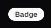
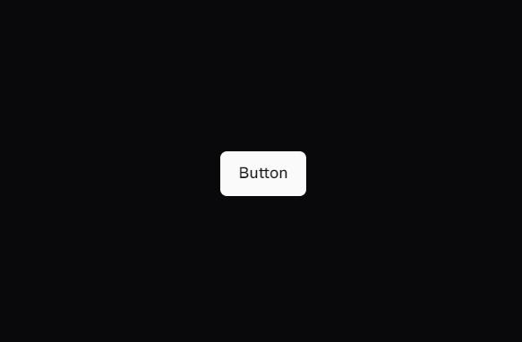

# Survey

## 1.  ***Card Preview***

A Card contains a preview of the content that is to be displayed. This can be a header, a body, a footer, or a combination of these. The card can also contain an image or an icon. It is generally used to display a small amount of information in a structured way.

## Here's an example of a card preview:

### Obstacles

- [x] Making the card dynamic.
- [x] Maintaining the association between the content and the card.
- [x] Tracking all the data that the user is working on.
- [x] Making the card responsive.

---

## 2. Badge

A badge is a small icon that is used to represent a particular status or feature. It is generally used to highlight a particular feature or status.

## Here's an example of a badge:

### Obstacles

- [x] Making the badge dynamic.
- [x] Making the badge customizable.
- [x] Making the badge responsive.

## 3. Button

A button is a clickable element that is used to perform an action. It is generally used to trigger an event or navigate to a different page.

## Here's an example of a button:

### Obstacles

- [x] Making the button dynamic.
- [x] Making the button customizable.